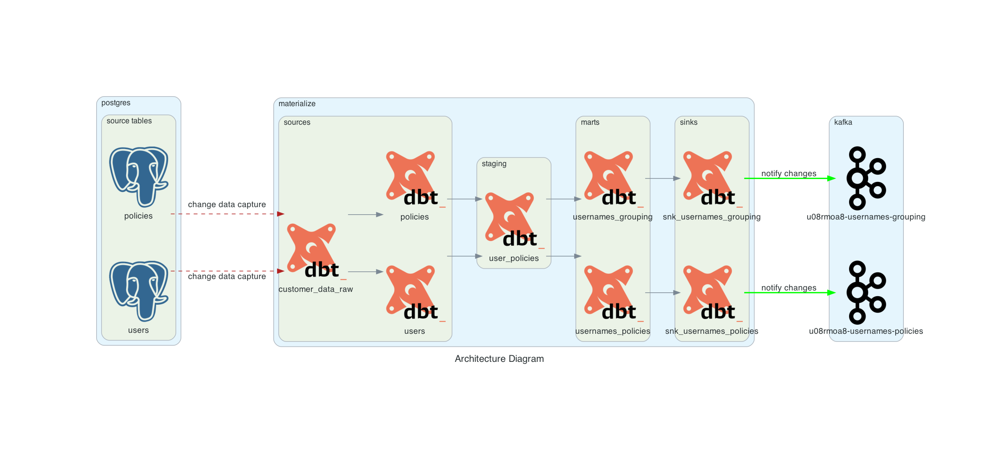

# cdc_streaming
Concept implementing a near real-time streaming architecture with postgres, dbt and Materialize.



## Tech stack
+ [dbt-core](https://github.com/dbt-labs/dbt-core) (cloud version: [dbt](https://www.getdbt.com))
+ [Materialize](https://materialize.com)
+ [PostgreSQL](https://www.postgresql.org)
+ [Kafka](https://kafka.apache.org) (clients: [Kowl](https://cloudhut.dev) / [Kafka Magic](https://www.kafkamagic.com))
+ [diagrams](https://diagrams.mingrammer.com)

## Setup

```bash
git clone https://github.com/gabrielecorni/cdc_streaming.git
```

or, if you want to reproduce the initial phases:

```bash
mkdir cdc_streaming
cd cdc_streaming
poetry init
# < interactively define dependencies by adding dbt-materialize >
dbt init cdc_streaming
# < move folders back to root >
# < delete some folders if unnecessary >
poetry shell
```

> Note: remember to update your `~/.dbt/profiles.yml` file as well.

## TL;DR
```bash
docker compose up -d    # start the system
dbt run                 # execute dbt model
< ... >                 # explore results
docker compose down     # stop the system
```
## Example of execution
Open 3 different shells at folder `cdc_streaming`, named `dbt`, `postgres`, `materialize`: 
+ (shell1) `dbt` -> `docker compose up -d`
+ (shell2) `postgres` -> `docker exec -it cdc_streaming-db-1 bash`
+ (shell3) `materialize` -> `docker run -it --rm --network=cdc_streaming_default materialize/cli`

Interact with the following CLI commands:

#### dbt shell
run the dbt model (once) and generate documentation:
```bash
dbt run                 # build the model
dbt docs generate       # build documentation
dbt docs serve          # serve documentation
```

#### postgres shell
login to the `datalake` db:
```bash
psql -U postgres -d datalake
```

execute the following SQL statements:
```bash
datalake=$ INSERT INTO SOURCE.USERS(ID, NAME, SURNAME) VALUES
datalake-$      (4, 'CAIO', 'MARIO');
INSERT 0 1
datalake=$ INSERT INTO SOURCE.POLICIES(ID, POLICY_DETAILS, USER_ID) VALUES
datalake-$      (5672, 'ANTI THEFT', 4),
datalake-$      (5559, 'MOTO INSURANCE', 4);
INSERT 0 2
datalake=$ UPDATE SOURCE.POLICIES SET POLICY_DETAILS='HOME INSURANCE' WHERE ID=5559;
UPDATE 1
datalake=$ DELETE FROM SOURCE.POLICIES WHERE ID=5559;
DELETE 1
datalake=$ DELETE FROM SOURCE.USERS WHERE ID=4;
DELETE 1
```
#### materialize shell
while executing the above-mentioned queries on Postgres (source database), see how correspondent structures change on Materialize (target database).
```bash
# DISCOVERY operations
\dv                                 # all views in db
show sources;                       # all sources
show views;                         # all views in dbt
show materialized views;            # all materialized views in dbt

# CRUD operations
SELECT * FROM CUSTOMER_DATA_RAW;    # mixed source publication
SELECT * FROM USERS;                # individual source view
SELECT * FROM POLICIES;             # individual source view
SELECT * FROM USER_POLICIES;        # staging model
SELECT * FROM USERNAMES_POLICIES;   # data mart
SELECT * FROM USERNAMES_GROUPING;   # data mart
```

#### kafka consumer
within the project, two different kafka consumers have been made available:
+ [kowl](http://localhost:8081)
+ [kafka magic](http://localhost:8082)

the correspondent kafka messages on topics are:
+ usernames_grouping
```json
[
  {
    "before": null,
    "after": {
      "row": {
        "codsog": 1,
        "nb_policies": 2
      }
    }
  },
  {
    "before": null,
    "after": {
      "row": {
        "codsog": 3,
        "nb_policies": 1
      }
    }
  },
  {
    "before": null,
    "after": {
      "row": {
        "codsog": 4,
        "nb_policies": 2
      }
    }
  },
  {
    "before": {
      "row": {
        "codsog": 4,
        "nb_policies": 2
      }
    },
    "after": {
      "row": {
        "codsog": 4,
        "nb_policies": 1
      }
    }
  },
  {
    "before": {
      "row": {
        "codsog": 4,
        "nb_policies": 1
      }
    },
    "after": null
  }
]
```
+ usernames_policies
```json
[
  {
    "before": null,
    "after": {
      "row": {
        "codsog": 3,
        "username": "CARLOVERDI",
        "codpol": 5555,
        "policy_details": "CAR INSURANCE"
      }
    }
  },
  {
    "before": null,
    "after": {
      "row": {
        "codsog": 1,
        "username": "MARIOROSSI",
        "codpol": 1234,
        "policy_details": "HOME INSURANCE"
      }
    }
  },
  {
    "before": null,
    "after": {
      "row": {
        "codsog": 1,
        "username": "MARIOROSSI",
        "codpol": 5678,
        "policy_details": "ANTI THEFT"
      }
    }
  },
  {
    "before": null,
    "after": {
      "row": {
        "codsog": 4,
        "username": "CAIOMARIO",
        "codpol": 5672,
        "policy_details": "ANTI THEFT"
      }
    }
  },
  {
    "before": null,
    "after": {
      "row": {
        "codsog": 4,
        "username": "CAIOMARIO",
        "codpol": 5559,
        "policy_details": "MOTO INSURANCE"
      }
    }
  },
  {
    "before": {
      "row": {
        "codsog": 4,
        "username": "CAIOMARIO",
        "codpol": 5559,
        "policy_details": "MOTO INSURANCE"
      }
    },
    "after": null
  },
  {
    "before": null,
    "after": {
      "row": {
        "codsog": 4,
        "username": "CAIOMARIO",
        "codpol": 5559,
        "policy_details": "HOME INSURANCE"
      }
    }
  },
  {
    "before": {
      "row": {
        "codsog": 4,
        "username": "CAIOMARIO",
        "codpol": 5559,
        "policy_details": "HOME INSURANCE"
      }
    },
    "after": null
  },
  {
    "before": {
      "row": {
        "codsog": 4,
        "username": "CAIOMARIO",
        "codpol": 5672,
        "policy_details": "ANTI THEFT"
      }
    },
    "after": null
  }
]
```

## Documentation
The auto-generated, interactive documentation can be found at [localhost:8080](http://localhost:8080/#!/overview).

## Useful links
These links helped me during the implementation of this project:
#### dbt
+ [What, exactly, is dbt?](https://www.getdbt.com/blog/what-exactly-is-dbt/)
+ [Available dbt adapters](https://docs.getdbt.com/docs/available-adapters)
#### dbt + Materialize
+ [Demos](https://github.com/MaterializeInc/demos)
+ [Available materializations](https://materialize.com/docs/integrations/dbt/#materializations)
+ [Create PostgreSQL source](https://materialize.com/docs/sql/create-source/postgres/)
+ [Create Kafka sinks](https://materialize.com/docs/sql/create-sink/)

#### troubleshooting
+ [How to setup dbt for Materialize](https://www.entechlog.com/blog/data/how-to-setup-dbt-for-materialize-db/)
+ [Materialize: Unable to automatically determine a timestamp for your query](https://www.markhneedham.com/blog/2020/12/31/materialize-unable-automatically-determine-timestamp-query/)
